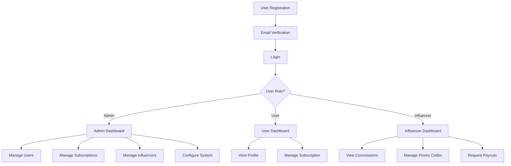
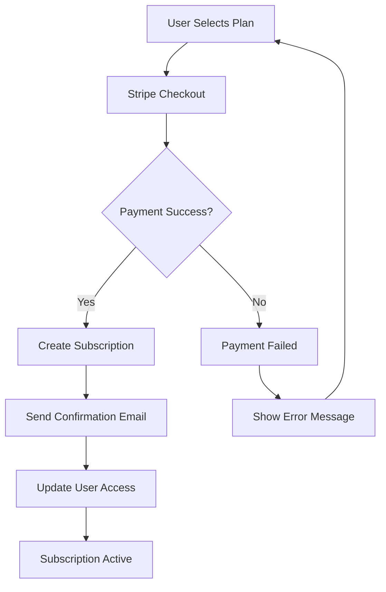
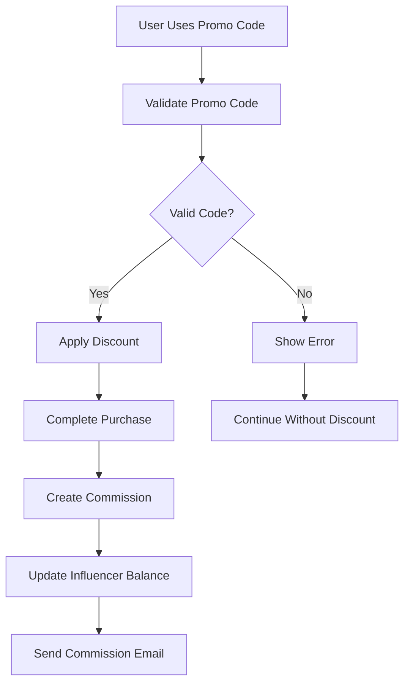
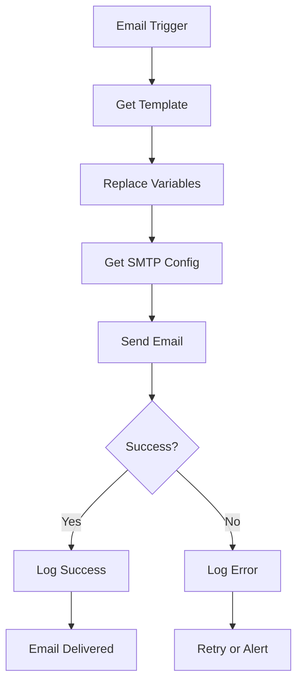

# 🚀 Kumu Coaching Platform - Backend Documentation

A comprehensive coaching platform with subscription management, influencer system, and dynamic configuration.

## 📋 Table of Contents

- [🏗️ Architecture Overview](#️-architecture-overview)
- [🔄 System Flows](#-system-flows)
- [🗄️ Database Schema](#️-database-schema)
- [🔌 API Documentation](#-api-documentation)
- [⚙️ Configuration](#️-configuration)
- [🚀 Getting Started](#-getting-started)
- [📁 Project Structure](#-project-structure)

## 🏗️ Architecture Overview

### System Components

```
┌─────────────────┐    ┌─────────────────┐    ┌─────────────────┐
│   Frontend      │    │   Backend       │    │   Database      │
│   (Next.js)     │◄──►│   (NestJS)      │◄──►│   (SQLite)      │
│   Port: 3002    │    │   Port: 3000    │    │   Local File    │
└─────────────────┘    └─────────────────┘    └─────────────────┘
         │                       │                       │
         │                       │                       │
         ▼                       ▼                       ▼
┌─────────────────┐    ┌─────────────────┐    ┌─────────────────┐
│   Admin Panel   │    │   API Gateway   │    │   Data Storage  │
│   Authentication│    │   JWT Auth      │    │   Entities      │
│   Dashboard     │    │   Validation    │    │   Migrations    │
└─────────────────┘    └─────────────────┘    └─────────────────┘
```

### Core Modules

1. **Authentication Module** - JWT-based auth with role management
2. **User Management** - User CRUD with profile management
3. **Subscription System** - Dynamic subscription plans with Stripe integration
4. **Influencer System** - Promo codes, commissions, and payouts
5. **Email System** - Dynamic SMTP configuration and templates
6. **Configuration System** - Dynamic app settings management

## 🔄 System Flows

### 1. User Registration & Authentication Flow



### 2. Subscription Purchase Flow



### 3. Influencer Commission Flow



### 4. Email System Flow



## 🗄️ Database Schema

### Core Entities

#### Users Table
```sql
CREATE TABLE users (
  id UUID PRIMARY KEY,
  email VARCHAR UNIQUE NOT NULL,
  password VARCHAR NOT NULL,
  firstName VARCHAR NOT NULL,
  lastName VARCHAR NOT NULL,
  phone VARCHAR,
  avatar VARCHAR,
  role VARCHAR DEFAULT 'user', -- 'user', 'admin', 'influencer'
  status VARCHAR DEFAULT 'active', -- 'active', 'inactive', 'suspended'
  emailVerified BOOLEAN DEFAULT false,
  emailVerificationToken VARCHAR,
  createdAt TIMESTAMP DEFAULT CURRENT_TIMESTAMP,
  updatedAt TIMESTAMP DEFAULT CURRENT_TIMESTAMP
);
```

#### Subscription Plans Table
```sql
CREATE TABLE subscription_plans (
  id UUID PRIMARY KEY,
  name VARCHAR NOT NULL,
  description TEXT NOT NULL,
  price DECIMAL(10,2) NOT NULL,
  type VARCHAR NOT NULL, -- 'monthly', 'quarterly', 'annual'
  durationInMonths INTEGER DEFAULT 1,
  features JSON, -- Array of features
  status VARCHAR DEFAULT 'active', -- 'active', 'inactive'
  isActive BOOLEAN DEFAULT true,
  stripeProductId VARCHAR,
  stripePriceId VARCHAR,
  createdAt TIMESTAMP DEFAULT CURRENT_TIMESTAMP,
  updatedAt TIMESTAMP DEFAULT CURRENT_TIMESTAMP
);
```

#### Subscriptions Table
```sql
CREATE TABLE subscriptions (
  id UUID PRIMARY KEY,
  userId UUID REFERENCES users(id),
  planId UUID REFERENCES subscription_plans(id),
  status VARCHAR DEFAULT 'pending', -- 'pending', 'active', 'cancelled', 'expired'
  amount DECIMAL(10,2) NOT NULL,
  stripeSubscriptionId VARCHAR,
  stripeCustomerId VARCHAR,
  startDate TIMESTAMP,
  endDate TIMESTAMP,
  cancelledAt TIMESTAMP,
  promoCodeId UUID REFERENCES promo_codes(id),
  createdAt TIMESTAMP DEFAULT CURRENT_TIMESTAMP,
  updatedAt TIMESTAMP DEFAULT CURRENT_TIMESTAMP
);
```

#### Influencers Table
```sql
CREATE TABLE influencers (
  id UUID PRIMARY KEY,
  userId UUID REFERENCES users(id) UNIQUE,
  commissionRate DECIMAL(5,2) NOT NULL, -- Percentage
  availableBalance DECIMAL(10,2) DEFAULT 0,
  totalEarned DECIMAL(10,2) DEFAULT 0,
  totalWithdrawn DECIMAL(10,2) DEFAULT 0,
  status VARCHAR DEFAULT 'active', -- 'active', 'inactive', 'suspended'
  stripeAccountId VARCHAR, -- For payouts
  stripeAccountStatus VARCHAR,
  createdAt TIMESTAMP DEFAULT CURRENT_TIMESTAMP,
  updatedAt TIMESTAMP DEFAULT CURRENT_TIMESTAMP
);
```

#### Promo Codes Table
```sql
CREATE TABLE promo_codes (
  id UUID PRIMARY KEY,
  code VARCHAR UNIQUE NOT NULL,
  influencerId UUID REFERENCES influencers(id),
  type VARCHAR DEFAULT 'percentage', -- 'percentage', 'fixed_amount'
  value DECIMAL(5,2) NOT NULL, -- Percentage or fixed amount
  maxDiscount DECIMAL(10,2),
  minOrderAmount DECIMAL(10,2),
  usageLimit INTEGER DEFAULT 0, -- 0 means unlimited
  usedCount INTEGER DEFAULT 0,
  status VARCHAR DEFAULT 'active', -- 'active', 'inactive', 'expired'
  expiresAt DATETIME,
  description TEXT,
  createdAt TIMESTAMP DEFAULT CURRENT_TIMESTAMP,
  updatedAt TIMESTAMP DEFAULT CURRENT_TIMESTAMP
);
```

#### Commissions Table
```sql
CREATE TABLE commissions (
  id UUID PRIMARY KEY,
  influencerId UUID REFERENCES influencers(id),
  subscriptionId UUID REFERENCES subscriptions(id),
  commissionRate DECIMAL(5,2) NOT NULL, -- Percentage at time of purchase
  commissionAmount DECIMAL(10,2) NOT NULL,
  status VARCHAR DEFAULT 'pending', -- 'pending', 'paid', 'cancelled'
  paidAt TIMESTAMP,
  stripePayoutId VARCHAR,
  createdAt TIMESTAMP DEFAULT CURRENT_TIMESTAMP,
  updatedAt TIMESTAMP DEFAULT CURRENT_TIMESTAMP
);
```

#### Configuration Tables
```sql
-- App Configuration
CREATE TABLE app_configs (
  id UUID PRIMARY KEY,
  key VARCHAR UNIQUE NOT NULL,
  value TEXT,
  description TEXT,
  isEncrypted BOOLEAN DEFAULT false,
  createdAt TIMESTAMP DEFAULT CURRENT_TIMESTAMP,
  updatedAt TIMESTAMP DEFAULT CURRENT_TIMESTAMP
);

-- Email Configuration
CREATE TABLE email_configs (
  id UUID PRIMARY KEY,
  key VARCHAR UNIQUE NOT NULL,
  value TEXT,
  description TEXT,
  isEncrypted BOOLEAN DEFAULT false,
  createdAt TIMESTAMP DEFAULT CURRENT_TIMESTAMP,
  updatedAt TIMESTAMP DEFAULT CURRENT_TIMESTAMP
);

-- Email Templates
CREATE TABLE email_templates (
  id UUID PRIMARY KEY,
  name VARCHAR UNIQUE NOT NULL,
  type VARCHAR NOT NULL, -- 'welcome', 'password_reset', 'email_verification', etc.
  subject VARCHAR NOT NULL,
  htmlContent TEXT NOT NULL,
  textContent TEXT NOT NULL,
  variables JSON, -- Array of available template variables
  status VARCHAR DEFAULT 'active', -- 'active', 'inactive'
  description TEXT,
  createdAt TIMESTAMP DEFAULT CURRENT_TIMESTAMP,
  updatedAt TIMESTAMP DEFAULT CURRENT_TIMESTAMP
);
```

## 🔌 API Documentation

### Authentication Endpoints

#### POST /auth/login
Login user and get JWT token.

**Request:**
```json
{
  "email": "admin@kumucoaching.com",
  "password": "Admin123!@#"
}
```

**Response:**
```json
{
  "accessToken": "eyJhbGciOiJIUzI1NiIsInR5cCI6IkpXVCJ9...",
  "expiresIn": 3600,
  "user": {
    "id": "uuid",
    "email": "admin@kumucoaching.com",
    "firstName": "Admin",
    "lastName": "User",
    "role": "admin",
    "status": "active"
  }
}
```

#### POST /auth/register
Register new user.

**Request:**
```json
{
  "email": "user@example.com",
  "password": "password123",
  "firstName": "John",
  "lastName": "Doe"
}
```

### Admin Endpoints

#### GET /admin/users
Get paginated list of users.

**Headers:** `Authorization: Bearer <token>`

**Query Parameters:**
- `page` (number): Page number (default: 1)
- `limit` (number): Items per page (default: 10)

#### GET /admin/subscription-plans
Get all subscription plans.

**Headers:** `Authorization: Bearer <token>`

#### POST /admin/subscription-plans
Create new subscription plan.

**Request:**
```json
{
  "name": "Premium Plan",
  "description": "Premium coaching features",
  "price": 99.99,
  "type": "monthly",
  "durationInMonths": 1,
  "features": ["Feature 1", "Feature 2"]
}
```

#### GET /admin/influencers
Get all influencers.

**Headers:** `Authorization: Bearer <token>`

#### POST /admin/influencers
Create new influencer.

**Request:**
```json
{
  "userId": "user-uuid",
  "commissionRate": 15.0
}
```

### Stripe Configuration

#### GET /admin/stripe/config
Get Stripe configuration.

**Headers:** `Authorization: Bearer <token>`

#### PUT /admin/stripe/config
Update Stripe configuration.

**Request:**
```json
{
  "secretKey": "sk_test_...",
  "publishableKey": "pk_test_...",
  "webhookSecret": "whsec_...",
  "currency": "usd",
  "mode": "test"
}
```

### Email Configuration

#### GET /admin/email/config
Get email configuration.

**Headers:** `Authorization: Bearer <token>`

#### PUT /admin/email/config
Update email configuration.

**Request:**
```json
{
  "host": "smtp.gmail.com",
  "port": 587,
  "user": "your-email@gmail.com",
  "pass": "your-app-password",
  "secure": false,
  "fromEmail": "noreply@kumucoaching.com",
  "fromName": "Kumu Coaching",
  "replyTo": "support@kumucoaching.com",
  "enabled": true
}
```

#### GET /admin/email/templates
Get all email templates.

**Headers:** `Authorization: Bearer <token>`

#### POST /admin/email/templates
Create new email template.

**Request:**
```json
{
  "name": "Welcome Email",
  "type": "welcome",
  "subject": "Welcome to Kumu Coaching!",
  "htmlContent": "<h1>Welcome {{firstName}}!</h1>",
  "textContent": "Welcome {{firstName}}!",
  "variables": ["firstName", "email"],
  "description": "Welcome email for new users"
}
```

### Public Endpoints

#### POST /promo-codes/validate
Validate promo code.

**Request:**
```json
{
  "code": "WELCOME20"
}
```

**Response:**
```json
{
  "valid": true,
  "discount": {
    "type": "percentage",
    "value": 20,
    "maxDiscount": 50
  }
}
```

## ⚙️ Configuration

### Environment Variables

The system uses dynamic configuration stored in the database. However, some basic environment variables are still needed:

```bash
# Database (for SQLite, these are optional)
DB_HOST=localhost
DB_PORT=5432
DB_USERNAME=cybillnerd
DB_PASSWORD=
DB_NAME=kumu_coaching

# JWT Configuration
JWT_SECRET=your-super-secret-jwt-key-change-this-in-production
JWT_EXPIRES_IN=1h

# Application
PORT=3000
NODE_ENV=development
```

### Dynamic Configuration

The system stores sensitive configuration in the database with encryption:

- **Stripe Keys**: Stored encrypted in `app_configs` table
- **Email Settings**: Stored encrypted in `email_configs` table
- **SMTP Credentials**: Encrypted and managed through admin panel

## 🚀 Getting Started

### Prerequisites

- Node.js 18+
- npm or yarn
- SQLite (included)

### Installation

1. **Clone and Install Dependencies**
```bash
cd kumu-coaching
npm install
```

2. **Start the Backend**
```bash
npm run start:dev
```

3. **Seed the Database**
```bash
npm run seed
```

4. **Access the System**
- Backend API: http://localhost:3000
- Admin Panel: http://localhost:3002/admin/login
- API Documentation: http://localhost:3000/api/docs

### Default Admin Credentials

- **Email**: `admin@kumucoaching.com`
- **Password**: `Admin123!@#`

## 📁 Project Structure

```
kumu-coaching/
├── src/
│   ├── admin/                 # Admin module
│   │   ├── dto/              # Data Transfer Objects
│   │   ├── admin.controller.ts
│   │   ├── admin.service.ts
│   │   └── admin.module.ts
│   ├── auth/                 # Authentication module
│   │   ├── dto/
│   │   ├── guards/
│   │   ├── strategies/
│   │   ├── auth.controller.ts
│   │   ├── auth.service.ts
│   │   └── auth.module.ts
│   ├── config/               # Configuration module
│   │   ├── config.service.ts
│   │   ├── config.module.ts
│   │   ├── database.config.ts
│   │   ├── database-sqlite.config.ts
│   │   ├── jwt.config.ts
│   │   └── stripe.config.ts
│   ├── email/                # Email module
│   │   ├── email.service.ts
│   │   └── email.module.ts
│   ├── entities/             # Database entities
│   │   ├── user.entity.ts
│   │   ├── subscription-plan.entity.ts
│   │   ├── subscription.entity.ts
│   │   ├── influencer.entity.ts
│   │   ├── promo-code.entity.ts
│   │   ├── commission.entity.ts
│   │   ├── app-config.entity.ts
│   │   ├── email-config.entity.ts
│   │   └── email-template.entity.ts
│   ├── influencer/           # Influencer module
│   │   ├── influencer.controller.ts
│   │   ├── influencer.service.ts
│   │   └── influencer.module.ts
│   ├── promo-codes/          # Promo codes module
│   │   ├── promo-codes.controller.ts
│   │   └── promo-codes.module.ts
│   ├── subscriptions/        # Subscription module
│   │   ├── dto/
│   │   ├── subscriptions.controller.ts
│   │   ├── subscriptions.service.ts
│   │   └── subscriptions.module.ts
│   ├── stripe/               # Stripe integration
│   │   ├── stripe.service.ts
│   │   └── stripe.module.ts
│   ├── database/             # Database utilities
│   │   ├── seeds/
│   │   └── index.ts
│   ├── common/               # Shared utilities
│   │   ├── decorators/
│   │   ├── dto/
│   │   ├── filters/
│   │   └── services/
│   ├── app.module.ts         # Main application module
│   └── main.ts               # Application entry point
├── docs/                     # Documentation
│   ├── api/                  # API documentation
│   ├── database/             # Database documentation
│   ├── architecture/         # Architecture docs
│   └── flows/                # System flow diagrams
├── test/                     # Test files
├── package.json
├── tsconfig.json
└── README.md
```

## 🔧 Development Commands

```bash
# Start development server
npm run start:dev

# Build for production
npm run build

# Start production server
npm run start:prod

# Run tests
npm run test

# Run e2e tests
npm run test:e2e

# Seed database
npm run seed

# Lint code
npm run lint

# Format code
npm run format
```

## 📊 Monitoring & Logging

- **API Documentation**: Available at `/api/docs` (Swagger)
- **Health Check**: Available at `/health`
- **Logging**: Console logging in development, structured logging in production
- **Error Handling**: Global exception filters with detailed error responses

## 🔒 Security Features

- **JWT Authentication**: Secure token-based authentication
- **Role-based Access Control**: Admin, User, and Influencer roles
- **Data Encryption**: Sensitive configuration data encrypted in database
- **Input Validation**: Comprehensive DTO validation
- **CORS Protection**: Configurable CORS settings
- **Rate Limiting**: Built-in rate limiting for API endpoints

## 🚀 Deployment

### Production Checklist

1. **Environment Variables**: Set production environment variables
2. **Database**: Configure production database (PostgreSQL recommended)
3. **Stripe**: Update to live Stripe keys
4. **Email**: Configure production SMTP settings
5. **SSL**: Enable HTTPS
6. **Monitoring**: Set up application monitoring
7. **Backup**: Configure database backups

### Docker Support

```dockerfile
# Dockerfile example
FROM node:18-alpine
WORKDIR /app
COPY package*.json ./
RUN npm ci --only=production
COPY . .
RUN npm run build
EXPOSE 3000
CMD ["npm", "run", "start:prod"]
```

---

## 📞 Support

For questions or issues:
- Check the API documentation at `/api/docs`
- Review the system flows in the `docs/flows/` directory
- Check the database schema in `docs/database/`

**Happy Coding! 🚀**
