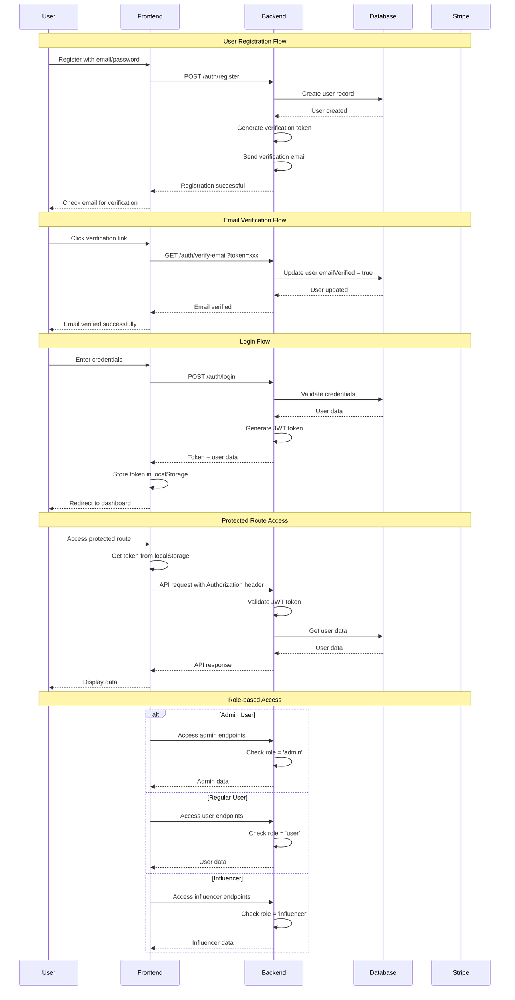

# Authentication Flow

## Overview
This document describes the complete authentication flow in the Kumu Coaching platform.

## Flow Diagram



## API Endpoints

### POST /auth/register
Register a new user account.

**Request Body:**
```json
{
  "email": "user@example.com",
  "password": "password123",
  "firstName": "John",
  "lastName": "Doe"
}
```

**Response:**
```json
{
  "success": true,
  "message": "User registered successfully. Please check your email for verification.",
  "data": {
    "id": "uuid",
    "email": "user@example.com",
    "firstName": "John",
    "lastName": "Doe",
    "emailVerified": false
  }
}
```

### POST /auth/login
Authenticate user and return JWT token.

**Request Body:**
```json
{
  "email": "user@example.com",
  "password": "password123"
}
```

**Response:**
```json
{
  "accessToken": "eyJhbGciOiJIUzI1NiIsInR5cCI6IkpXVCJ9...",
  "expiresIn": 3600,
  "user": {
    "id": "uuid",
    "email": "user@example.com",
    "firstName": "John",
    "lastName": "Doe",
    "role": "user",
    "status": "active",
    "emailVerified": true
  }
}
```

### GET /auth/verify-email
Verify user email address.

**Query Parameters:**
- `token`: Email verification token

**Response:**
```json
{
  "success": true,
  "message": "Email verified successfully"
}
```

## Security Features

1. **Password Hashing**: Passwords are hashed using bcrypt
2. **JWT Tokens**: Secure token-based authentication
3. **Email Verification**: Required for account activation
4. **Role-based Access**: Different access levels for users, admins, and influencers
5. **Token Expiration**: JWT tokens expire after 1 hour
6. **Input Validation**: All inputs are validated using DTOs

## Error Handling

### Common Error Responses

**Invalid Credentials:**
```json
{
  "success": false,
  "message": "Invalid email or password",
  "error": {
    "statusCode": 401,
    "message": "Unauthorized"
  }
}
```

**Email Not Verified:**
```json
{
  "success": false,
  "message": "Please verify your email address before logging in",
  "error": {
    "statusCode": 403,
    "message": "Email not verified"
  }
}
```

**Account Suspended:**
```json
{
  "success": false,
  "message": "Your account has been suspended",
  "error": {
    "statusCode": 403,
    "message": "Account suspended"
  }
}
```

## Frontend Integration

### Token Storage
```javascript
// Store token after login
localStorage.setItem('token', data.accessToken);
localStorage.setItem('user', JSON.stringify(data.user));

// Use token in API requests
const token = localStorage.getItem('token');
const headers = {
  'Authorization': `Bearer ${token}`,
  'Content-Type': 'application/json'
};
```

### Route Protection
```javascript
// Check authentication before accessing protected routes
useEffect(() => {
  const token = localStorage.getItem('token');
  const user = localStorage.getItem('user');
  
  if (!token || !user) {
    router.push('/login');
    return;
  }
  
  const parsedUser = JSON.parse(user);
  if (parsedUser.role !== 'admin') {
    router.push('/unauthorized');
    return;
  }
}, []);
```

## Database Schema

### Users Table
```sql
CREATE TABLE users (
  id UUID PRIMARY KEY,
  email VARCHAR UNIQUE NOT NULL,
  password VARCHAR NOT NULL,
  firstName VARCHAR NOT NULL,
  lastName VARCHAR NOT NULL,
  phone VARCHAR,
  avatar VARCHAR,
  role VARCHAR DEFAULT 'user',
  status VARCHAR DEFAULT 'active',
  emailVerified BOOLEAN DEFAULT false,
  emailVerificationToken VARCHAR,
  createdAt TIMESTAMP DEFAULT CURRENT_TIMESTAMP,
  updatedAt TIMESTAMP DEFAULT CURRENT_TIMESTAMP
);
```

## Testing

### Test Cases

1. **Registration Tests**
   - Valid registration
   - Duplicate email
   - Invalid email format
   - Weak password

2. **Login Tests**
   - Valid credentials
   - Invalid credentials
   - Unverified email
   - Suspended account

3. **Token Tests**
   - Valid token
   - Expired token
   - Invalid token
   - Missing token

4. **Role Tests**
   - Admin access
   - User access
   - Influencer access
   - Unauthorized access
